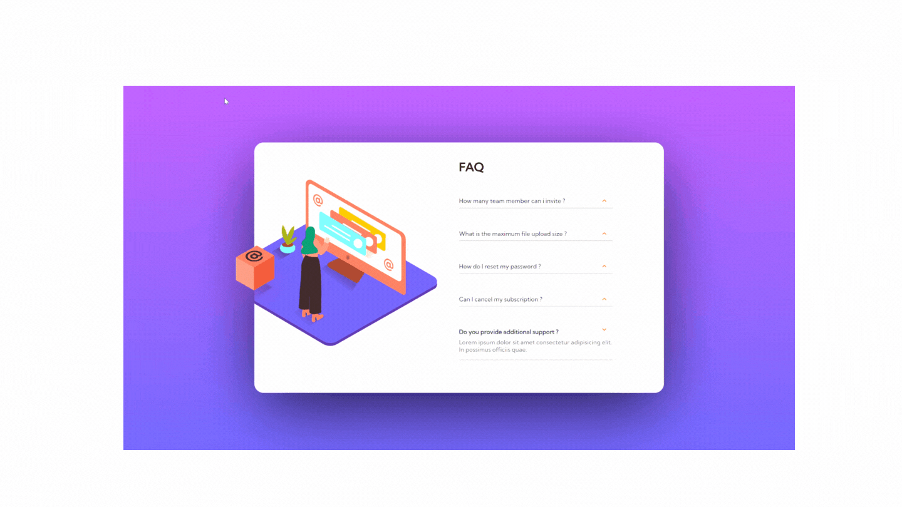
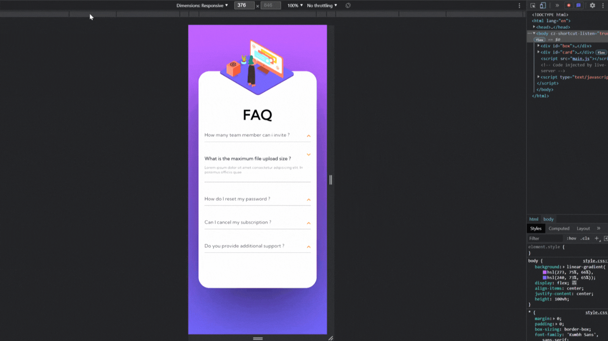

# FAQ---Responsive---Javascript

Challenge proposé sur le site Frontend Mentor.

Difficulté: Javascript

Création du css/html + coder en javascript la manière dont les divs (réponses aux questions) aller s'ouvrir et se fermer au moment d'un click dessus.
Cela avec des fleches qui s'animent faisant une rotation à 180°.

J'ai trouvé la solution en faisant une double boucle for. 
La première boucle permet de faire apparaitre la div correspondante en fonction de la question.
La seconde boucle à l'intérieur de la première boucle, permet de fermer une div lorsque l'on clique sur une autre div afin de ne pas avoir de doublons.

Petit détail, la box à question (sur la gauche) est animée pour "flotter".

Résultat:

Pour rendre le tout responsive j'ai utilisé un média queries qui s'adapte à un écran de 375px (équivalent d'un écran de smartphone).
Petit ajout d'une image flottante.

Résultat :

Ce que j'ai appris :
- L'utilisation d'une double boucle "for" afin d'interragir avec des éléments en NodeList ou Array.
- A fixer des éléments en fonction de la position: absolute et en fonction de son parent mis en position: relative.
- A créer des animations en CSS.
